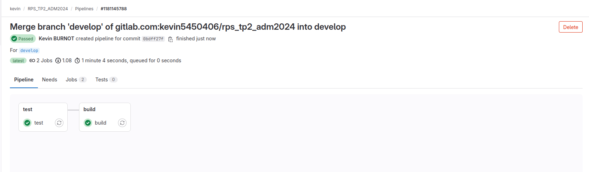

# Pierre Feuille Ciseaux

Ce code a été rédigé durant pour les cours Administration Système et gestion de code (4ETI) en février 2024 à CPE Lyon majeure robotique.
## Fonctionnement

Ce code permet de jouer à pierre feuille ciseaux, deux modes de jeux sont disponible le mode joueur simple qui se fait contre un ordinateur (mode ordi), et le mode de jeux 2 joueurs ou (mode 1v1), le choix du mode de jeux se fait au départ à l'aide d'un input utilisateur. Afin de jouer correctement il suffit de lancer rps_simplegame.py avec Python3. Le reste du jeux se fait avec des inputs console utilisateur. Pour quitter le jeux rentrer "no" après la fin d'une manche.

Désormais après la mise à jour V2.0 le mode de jeu contre ordinateur requiert un pseudo et permet la conservation des manches joués (obtionnel), Répondre "no" à Aimez vous les cookies ? pour ne rien sauvegarder.


## Installation
Le code a été rédigé avec Python 3.10.12

1. Cloner le dépôt depuis GitHub :
   ```bash
   git clone git@github.com:Darksasuke02/RPS_PARTIE2_4ETI_AdmCO_20232024.git
   ```

2. Créer un environnement virtuel
Pour télécharger venv sur Ubuntu (souvent déjà inclus dans le téléchargement de Python)
```console
sudo apt install python3-venv
```

Pour créer et utiliser un environnement virtuel:
```console
# Pour créer mon_environnement
python3 -m venv mon_environnement

# Pour activer mon_environnment 
source mon_environnement/bin/activate
#Vous pouvez désormais télécharger vos modules

# Pour désactiver mon_environnment
deactivate
```


3. Installer les dépendances 
```bash
pip install setuptools
```
unittest est présent dans la bibliothèque standart python il ne faut rien installer

4. Ajouter le package Game et RPS_Tools
```bash
#depuis les dossiers où se trouve les différents fichiers setup
pip install -e .
#ou
pip install -e chemin/vers/Game
pip install -e chemin/vers/RPS_Tools
```
Tout fonctionne vous pouvez lancer testop.py

## Fonctionnalité 1

Cette fonctionnalité permet de gérer les différents mode de jeux ici mode joueur simple et deux joueurs (1v1).

#### 1. Organisation du code

Le code étant développé par uniquement par moi même et cette fonctionnalité étant au coeur du fonctionnement général du projet. Elle a été développé sur une branche develop puis merge sur main afin de pouvoir publier une version fonctionnelle avec un tag
#### 2. Gestion des erreurs

Il y a différent types d'erreurs possible pour les erreurs qui sont liée aux inputs uitlisateurs, l'input sur le choix pierre feuille ou ciseaux (R,P,S) ne raise aucune erreur en cas de mauvais input, mais relance simplement la question avec un re.match si l'input ne correspond pas aux attentes.

Pour ce qui est de l'input Yes ou No pour relancer ou quitter le jeu, Il raise bien une erreur mais l'utilisation d'un try execept permet à cette erreur de ne pas être bloquante

La mise en place des test a été facilité par la mise en place de fake inputs, si jamais il y a erreur dans ces fakes input il y a un raise d'erreur qui cette fois est bloquant.
#### 3. Retour Pylint

Après toute les modifications possibles, le score final de pylint pour cette version est de 9.70/10 pour le module de test (testrps.py), de 9.71/10 pour le module de gestion des parties (rps_simplegame.py). Et de 9.52 pour le module de gestion des manches (rps_game.py)

#### 4. Les tests

Les tests s'exécutent en lancant le fichier testrps.py. Il ont été automatisé avec le module python unittest. 
Ils ont été particulièrement difficile à mettre en place notamment à cause d'erreurs fondamentale dans l'architecture et l'agencement du code. Il y a de nombreux inputs bloquant dans le module qui traite les manches ce qui pose ce qui rend la mise en place de tests très laborieux.
Finalement seul un petit nombre de test sur la méthode rps_play du module rps_game ont pu être mis en place.

La gestion de problématiques liée aux problèmes de codes n'étant pas l'objectif du module, mes codes de tests rentent incomplet et à améliorer.

#### 5. L'automatisation des tests et création du .whl

Pour tester, une copie du repository a été faite sur gitlab.
tout fonctionne correctement à la fois le test et la création de .whl.


## Fonctionnalité 2

Cette nouvelle fonctionnalité stocke les manches jouées uniquement pour les mangeurs de cookies. En effet, dans le mode de jeux contre l'ordinateur a été rajouté une phase de login et une sauvegarde des manches jouées (obtionnel).
Les manches sauvegardées sont stockées dans le fichier : manches_jouées.txt sous la forme une ligne une manche et "pseudo:X,Y" où X est le résultat (0:égalité, 1:victoire et 2:défaite) et Y le choix du joueur (R, P ou S)
La fonctionnalité a ensuite été merge puis tag sur la branche principale main.

#### 1. Organisation du code

La fonctionnalité 3 n'est pas dépendante de la fonctionnalité 2, ainsi il n'est pas possible de créer des branches pour chaques fonctionnalité car elles sont trop inter-dépendantes. C'est pourquoi la fonctionnalité 2 a été développé sur develop

#### 2. Gestion des erreurs

Cette fonctionnalité rajoute des inputs ainsi que du traitement de fichier il y a de nouvelles possibilités d'erreurs
L'input pseudo n'a pas de contraite et ne produira donc jamais d'erreur.
L'input "Aimez vous les cookies" et gérer avec un try exept qui produit un raise non bloquant si le format de la réponse ne convient pas.

Pour la gestion de l'écriture nous avons utilisées un try exept qui produit un raise bloquant en cas d'erreur. Cela s'explique par le fait que l'on souhaite vraiment pas avoir de problèmes avec la gestion de notre fichier de sauvegarde sensible.


#### 3. Retour Pylint

Après toute les modifications, le score final de pylint pour cette version est de 9.77/10 pour le module de test (testrps.py), est descendu à 9.38/10 pour le module de gestion des parties (rps_simplegame.py). Et de 9.52 pour le module de gestion des manches (rps_game.py) qui n'a pas changé ou presque.

#### 4. Les tests

Les tests s'exécutent en lancant le fichier testrps.py. Il ont été automatisé avec le module python unittest. 

Malgrès les difficultés de tests liée aux différents input bloquants, nous avons pu tester la classe GestionFichier et en particulier sa méthode ajouter_contenu.


#### 5. L'automatisation des tests et création du .whl

Rien ne change vraiment, pour tester, le gitlab a été mis à jour.
tout fonctionne correctement à la fois le test et la création de .whl.



